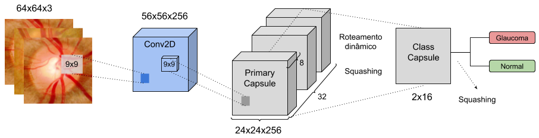
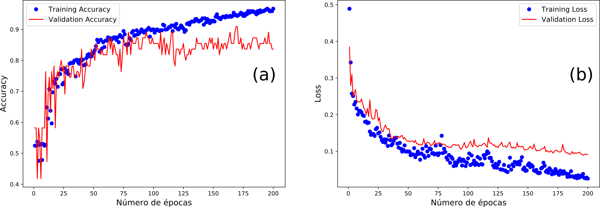

---

<h1 align="center">
  CapsNet para a classificação de imagens de retina
</h1>

  
  
  

---

## :smiley: Sobre o repositório

Neste respositório, disponibilizo um algoritmo para a classificação de imagens de retina em glaucomatosas e saudáveis, usando a arquitetura [CapsNet](https://arxiv.org/abs/1710.09829). Este algoritmo foi desenvolvido juntamente com o [Patrick Ryan](https://github.com/SalesRyan) em nosso período de Iniciação Científica na Universidade Federal do Piauí e apresentado como meu Trabalho de Conclusão de Curso III. Com o desenvolvimento deste projeto, publicamos o artigo ["A Capsule Network-based for identification of Glaucoma in retinal images"](https://ieeexplore.ieee.org/document/9219708), na IEEE Symposium on Computers and Communications (ISCC), em 2020.

---

## :bar_chart: Sobre a CapsNet

Um estudo recente, proposto por [Sabour, Frosst e Hinton (2017)](https://arxiv.org/abs/1710.09829), apresenta um novo modelo de Deep Learning, a Capsule Network (CapsNet), visando solucionar algumas desvantagens trazidas pelas CNNs tradicionais, como a grande quantidade de imagens necessárias para um bom treinamento e as operações de pooling, que, durante a redução dadimensionalidade das características, podem acabar perdendo informações importantes. Na CapsNet, os principais blocos são as cápsulas, essas estruturas analisam a relação espacial hierárquica das características para tentar representar melhor os dados. Dessa forma, ao contrário das CNNs que apenas identificam a presença das características em um objeto, as cápsulas identificam relacionamentos espaciais entre elas. Estudos recentes que aplicam a CapsNet apontam que é possível treinar esse modelo com menos amostras do que as CNNs tradicionais e ainda assim obter um bom desempenho.

O modelo implementado no algoritmo deste repositório seguiu as configurações originais da arquitetura, logo, foram utilizadas uma camada convolucional, uma camada de cápsulas primárias e uma camada totalmente conectada, que possui 16 dimensões por classe, isto é, glaucoma e normal. Na Figura abaixo, tem-se uma representação ilustrativa da arquitetura utilizada, onde é possível notar que há uma camada convolucional (Conv2D), uma camada de cápsulas primárias (Primary Capsule) e uma camada totalmente conectada (Class Capsule).

  

## :framed_picture: Sobre as bases de imagens

Para avaliar o modelo de classificação, foram utilizadas as bases de imagens de retina RIM-ONE v2 e Drishti-GS, onde ambos os conjuntos contêm imagens de disco óptico glaucomatosas e saudáveis. A RIM-ONE v2 possui 455 imagens oculares, sendo 200 imagens de retina com glaucoma e 255 imagens de retinas saudáveis. Já a Drishti-GS é composta de apenas 101 imagens, onde 70 delas apresentam retinas glaucomatosas e 31 apresentam retinas saudáveis.

Ambos as bases possuem tamanhos variados, estão no modelo de cores RGB e possuem 8 bits de profundidade. O algoritmo disponível neste repositório possui uma função de redimensionamento das imagens, através da biblioteca pillow e também uma função de equalização de histograma, da biblioteca skimage.

---

## :computer: Execução da aplicação

Inicialmente, clone este repositório executando:

    git clone https://github.com/VitoriaCarvalho/TCC3-CapsNet.git

Em seguida, navegue para o diretório onde o repositório foi clonado e instale as dependências do algoritmo através deste comando (é aconselhável criar um ambiente virtual antes de instalar as dependências, para evitar conflito com outros pacotes):

    pip install -r requirements.txt
    
Faça download das bases de imagem [neste link do Google Drive](https://drive.google.com/file/d/1TbJLkWrlIai_jwGejDJNYowmkoKn2DJR/view?usp=sharing), descompacte os arquivos e mova-os para o mesmo diretório onde está o código.
    
Com o ambiente configurado, basta executar:

    python capsnet.py

O modelo treinado, o histórico e a matriz de confusão serão salvos no diretório onde está o código.

No final da execução, espera-se do histórico de treinamento um desempenho semelhante a este, onde (a) refere-se à acurácia e (b) à perda do modelo:

  

---

## :muscle: Como contribuir

- Faça um fork desse repositório;
- Crie uma branch com a sua feature: `git checkout -b minha-feature`;
- Faça commit das suas alterações: `git commit -m 'feat: Minha nova feature'`;
- Faça push para a sua branch: `git push origin minha-feature`.

---

## :computer: Desenvolvedores

* Patrick Ryan Sales dos Santos - [SalesRyan](<https://github.com/SalesRyan/>)
* Vitória de Carvalho Brito - [VitoriaCarvalho](<https://github.com/VitoriaCarvalho/>)

---

## :memo: Licença

Esse projeto está sob a licença MIT. Veja o arquivo [LICENSE](https://github.com/VitoriaCarvalho/TCC3-CapsNet/blob/master/LICENSE) para mais detalhes.

---
